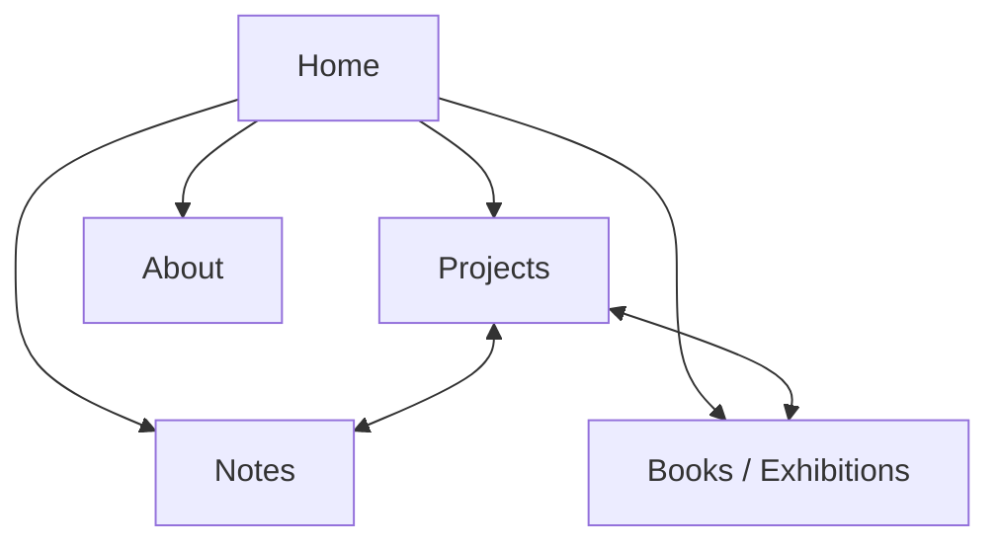

# ヤギュウショウ アーティスト・ポートフォリオサイト
## ページ構成検討資料

## 1. この資料の目的

ヤギュウショウのアーティスト活動をまとめるポートフォリオサイトについて、掲載する内容とページ構成を検討する。

現段階では、デザイン、レイアウト、書体、色、動き、使用技術、CMSなどは決定しない。

まずは以下を明らかにする。

- このサイトを何のためにつくるのか
- どのような内容を掲載するのか
- 内容をどのページに分けるのか
- 作品と文章をどのように関係づけるのか
- 今後の活動をどのように追加していくのか

---

## 2. サイトの目的

写真作品、制作途中の思考、詩や文章、展示、出版、他者との共同制作など、ヤギュウショウのアーティスト活動を一つの場所にまとめる。

完成した作品を見せるだけではなく、作品が生まれるまでの思考や、制作の途中で見つかった言葉も含めて蓄積する。

訪れた人が活動歴を確認するだけでなく、ヤギュウショウが世界をどのように見ているのかを知ることのできる場所を目指す。

## 3. 主な閲覧者

- 作品に関心を持った人
- 展示を見た人
- 編集者
- キュレーター
- ギャラリーや展示施設の関係者
- 写真家、美術家、作家などの表現者
- 共同制作を検討する人

商業撮影の依頼者を主な対象にはしない。

---

## 4. 掲載する内容

サイトに掲載する内容を、以下の5つに分ける。

### 作品

一つのテーマや問いをもとに制作された写真作品や複合的なプロジェクト。

完成作品だけでなく、現在進行中のプロジェクトも含む。

### 文章

- 詩
- 制作日記
- フィールドノート
- 写真や表現についての考察
- プロジェクトになる前の断片
- 他者との対話から生まれた文章

### 展示・出版

- 個展、グループ展
- ZINE、写真集、書籍
- イベントや発表
- 他者との共同制作

### 作家情報

- プロフィール
- 活動拠点
- 関心のあるテーマ
- 展示歴、出版歴
- 連絡先

### 活動の現在

- 進行中の制作
- 最近公開した文章
- 開催中または開催予定の展示
- 新しく刊行した本やZINE

---

## 5. 基本ページ構成

サイトの基本構成は以下の5ページとする。

1. Home
2. Projects
3. Notes
4. Books / Exhibitions
5. About

Contactは独立したページにせず、About内に含めることを基本とする。

---

## 6. Home

### 役割

サイトの入口として、現在の活動と主要な作品へつなぐ。

すべての情報を一覧化するのではなく、サイトの中に何があるのかを簡潔に示す。

### 掲載候補

- 作家名
- 短い言葉
- 主要なプロジェクト
- 現在進行中のプロジェクト
- 最新のNote
- 開催中または予定されている展示
- Projects、Notes、Books / Exhibitions、Aboutへの移動

### 検討事項

- Homeに主要作品だけを載せるか
- 最新の活動も載せるか
- 短い言葉を固定するか、更新できるようにするか
- 更新情報をどこまで表示するか

---

## 7. Projects

### 役割

ヤギュウショウの作品とプロジェクトをまとめて見るためのページ。

完成・未完成にかかわらず、それぞれを独立したプロジェクトとして扱う。

### 一覧に必要な情報

- 作品名
- 制作年または制作期間
- 代表画像
- 進行状況
- 短い説明

### 進行状況

- Ongoing：進行中
- Completed：一区切りついた作品
- Archive：過去の作品

この分類を実際に表示するかどうかは、掲載作品が揃ってから決める。

### 現在の掲載候補

- 『ごめんね』
- `.path`
- 伊勢の125社を巡るプロジェクト
- 抽象画家との共同プロジェクト

### 検討事項

- 制作年順に並べるか
- 重要度によって順番を決めるか
- 進行中と完成作品を分けるか
- 写真作品と共同制作を同じ一覧に置くか
- 過去の仕事や習作をどこまで含めるか

---

## 8. Project Detail

### 役割

一つの作品またはプロジェクトを詳しく見るためのページ。

写真だけでなく、その作品に関係する文章、制作過程、展示、出版なども一つの場所にまとめる。

### 掲載候補

- 作品名
- 制作年または制作期間
- 進行状況
- 写真
- 詩や短文
- ステートメント
- 制作の起点となった問い
- 制作中の記録
- 関連するNote
- 展示歴
- 書籍やZINE
- 共同制作者
- クレジット

### 情報の考え方

すべてのプロジェクトに同じ項目を求めない。

写真だけで成立するもの、文章を伴うもの、他者との対話を含むものなど、それぞれの活動に必要な内容を掲載する。

### 検討事項

- ステートメントを最初に置くか、写真の後に置くか
- 制作過程を作品と同じページに含めるか
- 展示後も進行中のプロジェクトとして更新するか
- 一つの作品に複数の文章を関連づけるか
- 展示版、書籍版、Web版の違いを記録するか

---

## 9. Notes

### 役割

完成した作品にはまだ含まれない思考や言葉を蓄積する。

ブログやニュースではなく、制作と並行して生まれる断片を置く場所とする。

### 掲載候補

- 詩
- 制作日記
- フィールドノート
- 短い考察
- 読書から生まれた文章
- 他者との対話
- 制作前のメモ
- 写真と短文

### Noteごとに必要な情報

- タイトル
- 本文
- 公開日
- 写真
- 種別
- 関連するProject

タイトルのない文章にも対応できる構成を想定する。

### 種別の候補

- Note
- Poem
- Field Note
- Text
- Conversation

最初から細かく分類せず、実際に掲載する文章を確認してから決める。

### 検討事項

- Notesを公開時から設けるか
- 詩と制作記録を同じ一覧に置くか
- 日付順にするか
- タイトルのない文章をどう扱うか
- 長い文章も掲載するか
- 個人的な日記との境界をどこに置くか

---

## 10. ProjectsとNotesの関係

ProjectsとNotesは別のページに分けるが、完全には切り離さない。

例えば、`.path`に関するフィールドノートはNotesにも掲載し、`.path`の作品ページからも読めるようにする。

一つのNoteが複数のProjectに関係する可能性もある。

### 関係づけの例

| Note | 関連するProject |
|---|---|
| 道を外れることについて | `.path` |
| 神社を巡る途中で見た苔と岩 | 伊勢の125社 |
| 距離はどこにあるのか | 『ごめんね』 |
| 線のない地図 | 抽象画家との共同プロジェクト |

### 検討事項

- Project Detailに関連Noteの一覧を置くか
- Note側にも関連Projectを表示するか
- 制作メモをProject内だけに置く場合との違い
- 同じ文章を重複掲載せず、どちらかを参照する形にするか

---

## 11. Books / Exhibitions

### 役割

作品が本、ZINE、展示、共同制作などの形で発表された記録をまとめる。

経歴だけを列挙するのではなく、それぞれの発表内容を個別に確認できるようにする。

### 一覧に必要な情報

- タイトル
- 年
- 種別
- 関連するProject
- 会場または発行元

### 種別の候補

- Exhibition
- Book
- Zine
- Collaboration

### 詳細ページに掲載する候補

- 展示または刊行物の名称
- 開催期間または発行日
- 会場または発行元
- 概要
- 記録写真
- 展示作品
- 関連するProject
- 共同制作者
- クレジット
- 外部情報

### 検討事項

- BooksとExhibitionsを一つのページにまとめるか
- それぞれを独立ページにするか
- 展示歴一覧と詳細記録を両方持つか
- 共同制作をProjectsとどちらに置くか
- 販売情報を掲載するか

---

## 12. About

### 役割

作家の活動の輪郭と連絡先を伝える。

### 掲載候補

- ヤギュウショウという名前
- プロフィール
- 活動拠点
- 写真や制作に対する考え
- 主な関心領域
- 展示歴
- 出版歴
- 受賞歴がある場合はその情報
- 連絡先
- SNSや外部サイト

### 商業活動について

商業撮影やデザインの活動は、このサイトの中心には置かない。

掲載する場合は以下のいずれかを検討する。

- Aboutの末尾に短く記載する
- 商業活動用の別サイトへリンクする
- このサイトには掲載しない

### 検討事項

- アーティストステートメントを掲載するか
- 略歴と長いプロフィールを分けるか
- 展示歴をBooks / Exhibitionsと重複して載せるか
- ポートレートを掲載するか
- 連絡先をメールアドレスだけにするか

---

## 13. 現在のプロジェクト整理

### 『ごめんね』

妻との距離、謝ることのできない自分、置き去りにされた自分をめぐる写真作品。

中心にある考え：

- 距離は二人のあいだだけでなく、自分の内部にも存在する
- 「ごめんね」は妻だけでなく、置き去りにしてきた自分へ向けられている
- 家族や親密さを、幸福の記録だけではない揺らぎとして扱う

関連する可能性がある内容：

- 写真作品
- 詩や文章
- 制作記録
- 展示記録
- ZINE

### `.path`

人間が道を基準として世界を認識していることへの疑問から始まった作品。

中心にある考え：

- 道は目的地へ向かう視線を生む
- 道の外側にあるものは、背景や余白として見逃されやすい
- 道を前提としない認識は可能か
- 忘れられた、または見逃された世界の見え方を回復したい

関連する可能性がある内容：

- 写真作品
- フィールドノート
- 道や認識についての文章
- 撮影場所の記録

### 伊勢の125社を巡るプロジェクト

伊勢の神社を巡りながら、神道を過去の文化としてではなく、現在の身体感覚や土地との関係として捉える。

社殿そのものの記録を主目的とせず、その周辺にある苔、岩、風、道、光、人の気配などを撮影する。

関連する可能性がある内容：

- 写真作品
- 巡った場所の記録
- フィールドノート
- 神道についての文章
- 巡礼中の身体感覚

### 抽象画家との共同プロジェクト

抽象画家との対話や共同制作から生まれる進行中のプロジェクト。

現時点では、展示や本などの最終形を決めていない。

中心にある考え：

- 自分の中にある「線のない地図」を理解していく
- 個人的な関係だけに閉じない作品にする
- 完成形より、対話と制作の変化を大切にする

関連する可能性がある内容：

- 写真
- 絵画
- 対話
- 制作記録
- 文章
- 展示または本

---

## 14. ページ間の移動

各ページは、以下の関係でつながる。



### 主な移動

- Homeから主要なProjectへ
- Homeから最新のNoteへ
- Projectから関連するNoteへ
- Projectから関連する展示や本へ
- Noteから関連するProjectへ
- 展示や本から元になったProjectへ
- すべてのページからAboutへ

---

## 15. サイト構成の別案

基本案を決定する前に、以下の3つを比較する。

### 構成A：5ページ型

```text
Home
Projects
Notes
Books / Exhibitions
About
```

作品、文章、発表記録を明確に分ける構成。

長所：

- 内容を探しやすい
- 活動が増えても整理しやすい
- ProjectsとNotesをそれぞれ独立して蓄積できる

検討点：

- 掲載内容が少ない初期段階ではページが分散する
- Books / Exhibitionsの情報量が少ない可能性がある

### 構成B：4ページ型

```text
Home
Projects
Notes
About
```

本や展示の情報を各ProjectとAboutに含める構成。

長所：

- 初期段階でも内容が薄く見えにくい
- 一つの作品に関する情報がProject Detailにまとまる
- ページ数が少なく理解しやすい

検討点：

- 展示や出版が増えたときに独立ページが必要になる
- 複数のProjectにまたがる展示を整理しにくい

### 構成C：3ページ型

```text
Home
Index
About
```

Projects、Notes、Books、Exhibitionsを一つのIndexにまとめる構成。

長所：

- 写真、文章、展示を同列に扱える
- 活動を分類しすぎずに見せられる
- 初期の掲載数が少なくても成立しやすい

検討点：

- 内容が増えると探しにくくなる
- 作品と短いメモの違いが伝わりにくい
- 分類方法を別途考える必要がある

---

## 16. 現時点での推奨構成

現時点では、以下の4ページ型を第一候補とする。

```text
Home
Projects
Notes
About
```

本や展示は、それぞれのProject Detailに記録する。

展示歴と出版歴の一覧はAboutに掲載する。

今後、展示や出版の数が増えた段階で、Books / Exhibitionsを独立させる。

この構成を推奨する理由：

- 作品と思考を中心にできる
- 初期段階でページを増やしすぎない
- 展示やZINEを作品から切り離さずに扱える
- 将来的に5ページ型へ拡張できる

---

## 17. Claudeに依頼したいこと

Claudeには、デザインや実装を始める前に、ページ構成について以下を検討してもらう。

1. 4ページ型を基本としたサイトマップ
2. 各ページに掲載する情報
3. Project Detailに必要な項目
4. ProjectsとNotesの関係
5. 展示・出版情報の置き場所
6. 将来コンテンツが増えた場合の拡張方法
7. 現時点で不足している情報

---

## 18. Claudeへの初回依頼文

```text
添付した「ヤギュウショウ アーティスト・ポートフォリオサイト ページ構成検討資料」を読み、サイトのページ構成を一緒に検討してください。

現段階では、デザイン、レイアウト、書体、色、アニメーション、使用技術、CMSについては提案せず、ページ構成と掲載内容だけを考えてください。

このサイトは商業撮影の営業サイトではなく、写真作品、制作途中の思考、詩や文章、展示、出版、共同制作をまとめる作家活動のための場所です。

現在は以下の4ページ型を第一候補としています。

- Home
- Projects
- Notes
- About

本や展示は各Project Detailに記録し、展示歴・出版歴の一覧はAboutに置く想定です。

まず以下を提示してください。

1. この4ページ構成の長所と弱点
2. 必要なページと不要なページ
3. 各ページに掲載する情報
4. Project Detailの構成案を3パターン
5. ProjectsとNotesをどのように関連づけるか
6. Books / Exhibitionsを独立させるべき時期
7. ページ構成を決めるためにヤギュウショウへ確認したい質問

デザインについては、ページ構成が決まるまで触れないでください。
```

---

## 19. 次に決めること

ページ構成を確定するために、ヤギュウショウ本人が次の内容を検討する。

1. Notesを公開時から設けるか
2. 制作途中のProjectをどこまで公開するか
3. Project Detailに制作過程を含めるか
4. 展示と出版を作品ページの一部として扱うか
5. Aboutにどこまで経歴を掲載するか
6. 商業活動への導線を設けるか
7. 最初の公開時に掲載するProjectを何件にするか

